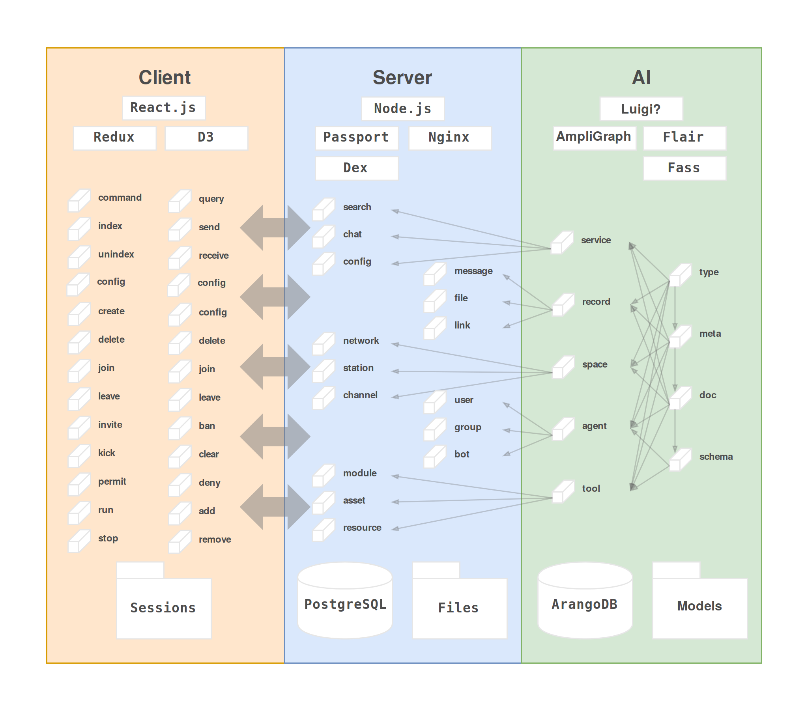
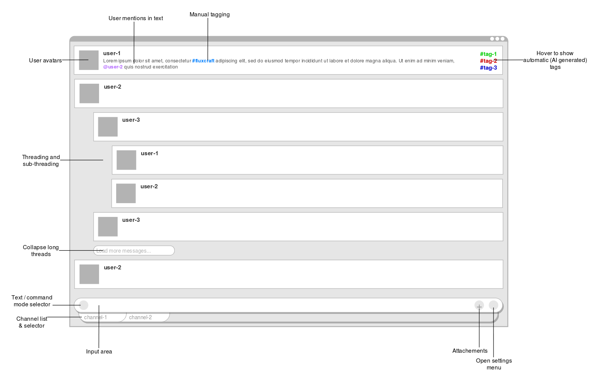

# fluxcell

fluxcell is a bot, messaging platform, database and search engine rolled into one. Its designed to support sustainable self-organization, by helping you share, tag and query your data, and tune where and how it is stored, transformed and modeled. Importantly, fluxcell strives towards a powerful and security minded role-based access control system to help individuals, communities and organizations regulate access to data.

This is in early development, not really usable.

## Running

To run, use the `./fluxcell` CLI, with an optional `--dev` flag for hotloaded development mode.

This wraps docker-compose, so you can:

```bash
./fluxcell --dev up -d --build
```

To run a development build, which should only be rebuilt when dependencies change.

## Data Model

* **space** - each contains the level below
  - *network* - a top-level space - in our case the space of the fluxcraft network but people might set up others
  - *zone* - an intermediate space for discourse within the network but across stations
  - *station* - a workstation for an individual or community to operate in, containing channels
  - *channel* - a conversation space for a particular purpose like an organizational or operational unit (team, project, operation)
  - *thread* - a topic space for talking about a particular issue

* **service** - endpoint bundling abstraction
  - *parse* - register input and produce parsed output
  - *query* - poke around with the index for search, update and management
  - *config* - create / modify / destroy objects

* **document** - nested JSON like record type checked by the ai
  - *record* - raw document
    + *message* - raw chat message
    + *file* - raw file
    + *link* - raw url
  - *artifact* - parsed document
    + *entity* - parsed node document
    + *relation* - parsed edge document
    + *reference* - resource source and cache location and time

* **agent** - an entity with permissions in the RBAC system, each top-level list item contained in the next
  - *user* - an individual agent
    + *member* - a human individual agent
        bot - a virtual individual agent
    + *group* - a collective of individual agents
        team - a hierarchical group
        circle - a nonhierarchical group
    + *org* - a collective of groups

* **tool** - eventual representation of infrastructure and app endpoints



## User Interface



